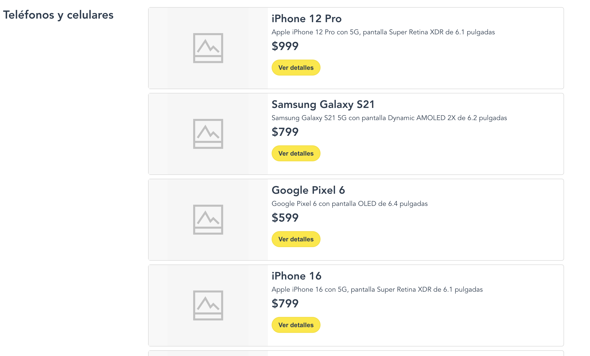
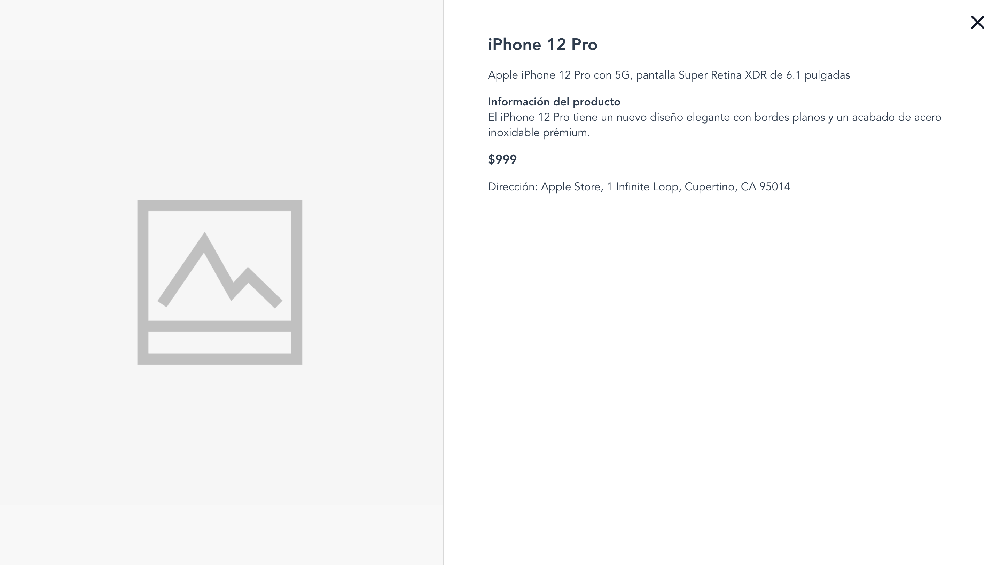

# Meli Frontend Challenge

This React-based web application showcases a dynamic item listing and filtering system for a specific category of products. The app is designed with performance optimization in mind, implementing pagination to load items in segments of 10. As users scroll through the page, additional segments are loaded seamlessly, providing a smooth browsing experience.

The application is fully responsive, scaling seamlessly from desktop to mobile devices. The smallest mobile device considered in the design is the iPhone SE, ensuring a good user experience across a wide range of screen sizes.

## Getting Started

To run this project locally on your machine, follow these steps:

### Prerequisites

- Node.js (v14.0 or later recommended)
- npm (v6.0 or later recommended)

(Download and install Node.js and npm from [nodejs.org](https://nodejs.org/en/download/))

### Installation

1. Clone the repository:

```bash
git clone https://github.com/simonalvarado/meli-challenge.git
```

2. Navigate to the project directory:

```bash
cd meli-challenge
```

3. Install the project dependencies:

```bash
npm install
```

### Running the Application

1. Start the backend server:

```bash
npm run server
```

2. Start the frontend development server:

```bash
npm start
```

3. Open your browser and navigate to `http://localhost:3000` to access the application.

## Testing

This project uses Jest for testing. To run the tests, use the following command:

```bash
npm test
```

## Structure

The project is structured as follows:

### Header

The header contains the logo and a search bar. The search bar allows users to search for items by name.


### Items List

The items list is a list of items that are displayed in a grid format. The items are loaded from the backend server.



### Item Detail Modal

The item detail modal is a modal that displays the details of an item. The modal is displayed when the user clicks on the "Ver Detalle" button in the items list.



## Built With

- React
- Node.js
- Jest

## Author

- [Simón Alvarado](https://simonalvarado.com/)
- For any questions or comments, please contact me at my email: simonjesusalvarado@gmail.com
